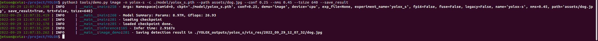
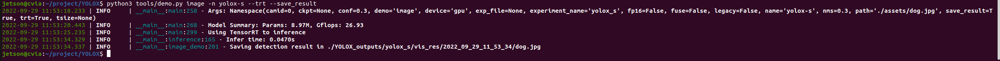
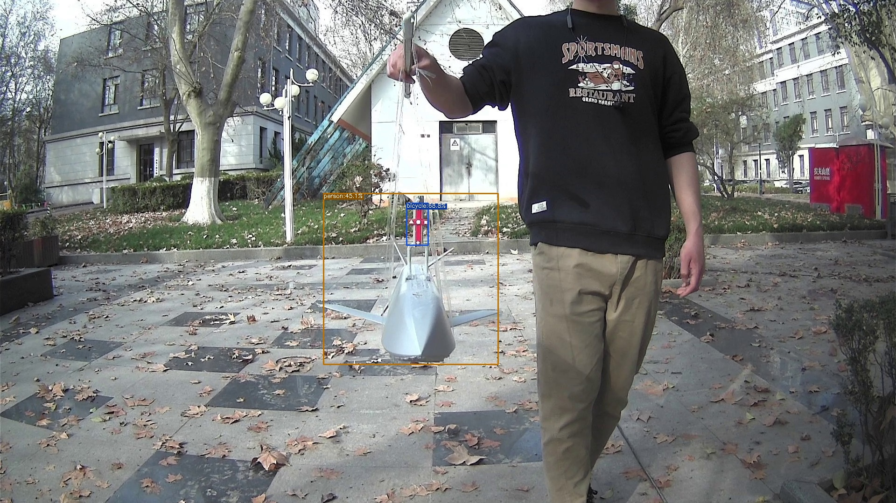

# Xavier YOLOX Deployment

## Xavier enviorment  
    Xavier使用的环境如下：
        JetPack 5.0.1 Developer Preview (L4T R34.1.1)
        Python 3.8.10
        cuda 11.4
        TensorRT 8.4


## Installation


Step1. 安装pytorch和torchvision.  
    在r34.1.1下，官方建议使用的版本:  
- pytorch v1.12.0
- torchvision v0.12.0

在[Jetson Pytorch](https://forums.developer.nvidia.com/t/pytorch-for-jetson/72048)下载在jetson上预编译好的PyTorch pip wheel,这里下载的是torch-1.12.0a0+2c916ef.nv22.3-cp38-cp38-linux_aarch64.whl
```shell
#安装pytorch
sudo apt-get install python3-pip libopenblas-base libopenmpi-dev libomp-dev
pip3 install Cython
pip3 install numpy torch-1.12.0a0+2c916ef.nv22.3-cp38-cp38-linux_aarch64.whl
#安装torchvision
sudo apt-get install libjpeg-dev zlib1g-dev libpython3-dev libavcodec-dev libavformat-dev libswscale-dev
git clone --branch v0.12.0 https://github.com/pytorch/vision torchvision 
cd torchvision
export BUILD_VERSION=0.12.0   
python3 setup.py install --user
```

Step2. Install YOLOX from source.
```shell
git clone git@github.com:Megvii-BaseDetection/YOLOX.git
cd YOLOX
pip3 install -v -e .  # or  python3 setup.py develop
```


## 运行demo

yolox安装完成之后，尝试运行官方提供的demo程序  

```shell
python3 tools/demo.py image -n yolox-s -c /home/jetson/project/YOLOX/model/yolox_s.pth --path assets/dog.jpg --conf 0.25 --nms 0.45 --tsize 640 --save_result --device gpu
```


## TensorRT部署
参考:https://github.com/Megvii-BaseDetection/YOLOX/tree/main/demo/TensorRT/cpp
TensorRT是可以在NVIDIA各种GPU硬件平台下运行的一个C++推理框架,可针对NVIDIA系列硬件进行优化加速，实现最大程度的利用GPU资源，提升推理性能.
torch2trt是NVIDIA官方维护的一个易于使用的PyTorch到TensorRT转换器.
1.安装torch2trt
```sheel
git clone https://github.com/NVIDIA-AI-IOT/torch2trt
cd torch2trt
sudo python3 setup.py install #if No module named packaging,pip3 install packaging
```
ps:How does torch2trt work?
转换原理流程大致如下：
- 导出网络定义以及相关权重；
- 解析网络定义以及相关权重；
- 根据显卡算子构造出最优执行计划；
- 将执行计划序列化存储；
- 反序列化执行计划；
- 进行推理
值得注意的是第三点，可以看到tensorrt转换出来的engine模型实际上是和硬件绑定的，也就是在部署的过程中，如果显卡和显卡相关驱动软件（cuda、cudnn）发生了改变，那么模型就得需要重新做转换
2.pth转engine
```shell
cd YOLOX
python3 tools/trt.py -n yolox-s -c ./model/yolox_s.pth #转换需要一段时间
```
执行完成后会在YOLOX_outputs/yolox_s目录下生成.engine文件
3.TensorRT模型Python推理测试
The TensorRT python demo is merged on our pytorch demo file, so you can run the pytorch demo command with --trt.
```sheel
python3 tools/demo.py image -n yolox-s --trt --save_result 
```
使用TensorRT前后推理速度对比  

  
4.编译C++推理测试  
修改CMakeLists.txt
```shell
cmake .
make
./yolox model_trt.engine -i /home/jetson/project/YOLOX/assets/dog.jpg #yolox-s:50ms,yolox-nano:22ms
```
5.UAV移植
```sheel
python3 tools/demo.py image -n yolox-nano -c ./model/UAV/yolox_nano.pth --path /home/jetson/project/uav_anchor_image/00006.jpg --conf 0.25 --nms 0.45 --tsize 416 --save_result --device gpu #通过
```
  

方法一：(yolox官方提供的脚本)直接用trt.py获取model，修改yolox_base.py中self.num_classes = 2,self.input_size = (416, 416),self.test_size = (416, 416)   
```shell
python3 tools/trt.py -f exps/default/yolox_nano.py -c ./model/UAV/yolox_nano.pth # engine file generate in YOLOX_outputs
./demo/TensorRT/cpp/yolox YOLOX_outputs/yolox_nano/model_trt.engine -i /home/jetson/project/uav_anchor_image/00006.jpg
```
方法二：onnx文件转engine(TensorRT自带的tetexec工具)
```shell
./usr/src/tensorrt/bin/trtexec --onnx=model/UAV/yolox_nano.onnx --saveEngine=model/UAV/yolox_nano.engine --workspace=1024 --fp16  # 通过 22ms
```

## 参考

[YOLOX github](https://github.com/Megvii-BaseDetection/YOLOX#quick-start)

[Jetson Pytorch](https://forums.developer.nvidia.com/t/pytorch-for-jetson/72048)